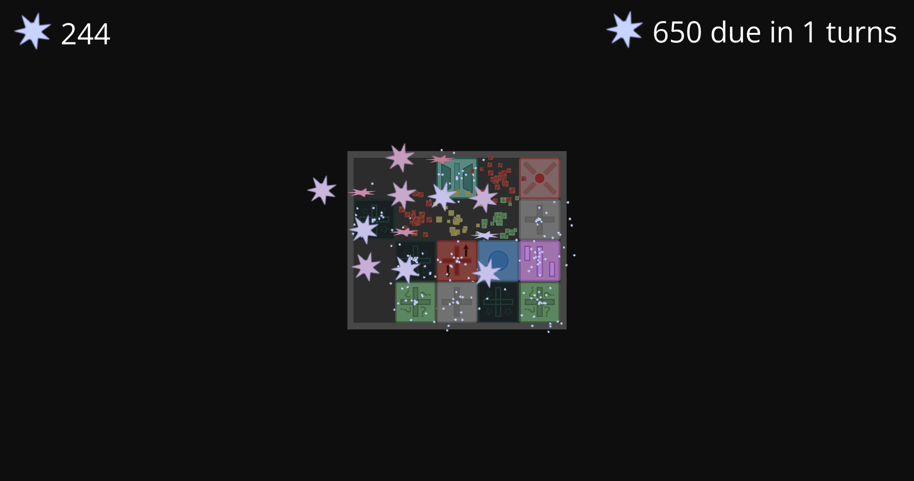
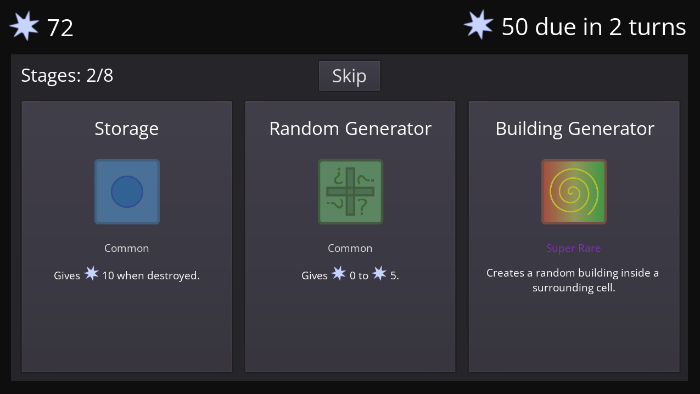

# Anti Flux

Game made made using Godot where you place special and different buildings and
generate antimatter to pass through stages.

[Web version](https://calbabreaker.github.io/anti-flux) is quite laggy.
[Download standalone versions instead.](https://github.com/Calbabreaker/anti-flux/releases/latest)

## Documents

-   [research.md](docs/research.md)
-   [plan.md](docs/plan.md)
